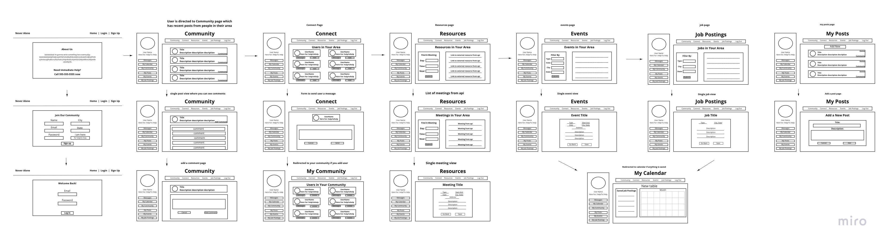
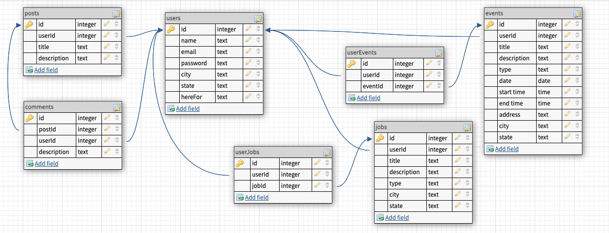

# Solo-Project-3-Front

## Overview

---

Never Alone is an app designed to help people that are struggling with addiction. Users can sign up as "looking for help" or "looking to help" and connect with eachother when in need. Users can find local resources, ask questions or simply share their experiences in the public forum in order to help eachother through recovery. Users can also post jobs that are available to people with records.

## User Stories

---

 

## Wireframes & ERD

---

## Routes Inventory

---

| Route       | Description |
| ----------- | ----------- |
| POST /users/signup | add a new user to users table |
| POST /users/login  | send info to back to check password and send user info to the front |
| GET /users/verify | get user info to display profile | 
| GET /users/posts  | gets posts by user               |
| POST/posts/add        | add a post to the forum page |
| GET/posts/all         | get all posts                |
| GET/posts/comments    | get comments                 |
| POST/comments         | add a comment                |
| POST/jobs/add         | add a new job posting        |
| GET/jobs/all          | get all jobs                 |

## MVP Checklist

---

1. Set up database, servers, front & back
2. Make tables and associations
3. Set up routes and functions for back end
4. Set up pages/components & nav bar
5. Routes & states for front end
5. Functions and forms for adding posts/comments/jobs
6. Fetch resources from helpline api 
7. Fetch meetings from AA api

## Stretch Goals

---

1. Direct messaging
2. Annonymous option
3. Chat Rooms with multiple people

